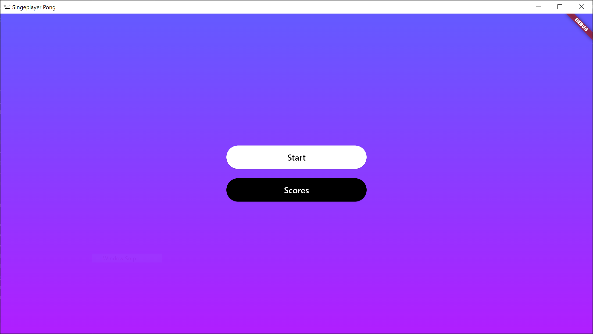
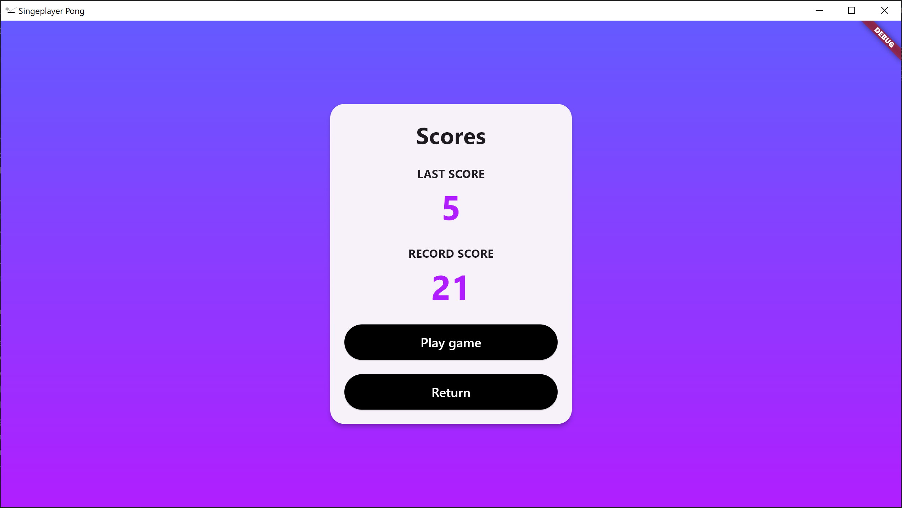
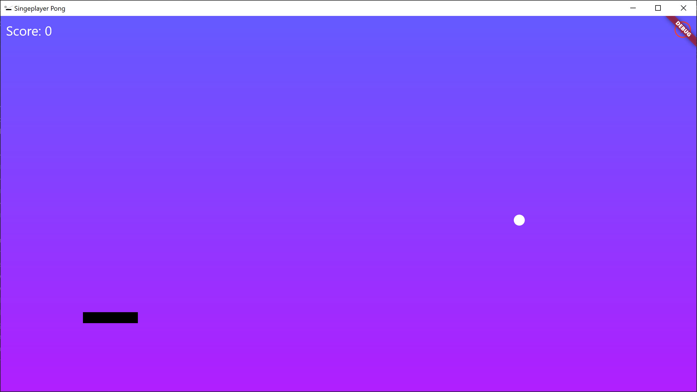
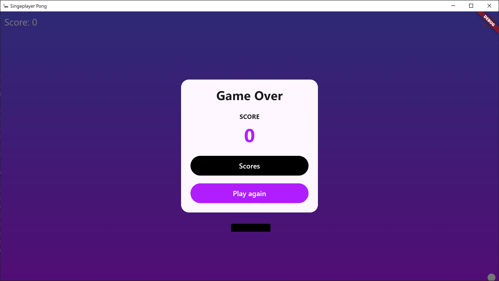

# singleplayerpong

A new Flutter project.

## Getting Started

This project is a starting point for a Flutter application.

A few resources to get you started if this is your first Flutter project:

- [Lab: Write your first Flutter app](https://docs.flutter.dev/get-started/codelab)
- [Cookbook: Useful Flutter samples](https://docs.flutter.dev/cookbook)

For help getting started with Flutter development, view the
[online documentation](https://docs.flutter.dev/), which offers tutorials,
samples, guidance on mobile development, and a full API reference.

## Game

The game is a singleplayer version of the original pong game. 

Objective:
The main objective is that the ball must not touch the bottom of the screen. The ball can bounce on the walls, the roof and the paddle.

Controls: 
The paddle can be controlled with the 'A' and 'D' keys or clicking on the screen with the left mouse button. It moves with a constant speed and stops at the edge of the game area.

Points: Every bounce is worth one point. The ball does not speed up, it moves with a constant speed. The angle of the bounce  is determined randomly.

Images from the game:

